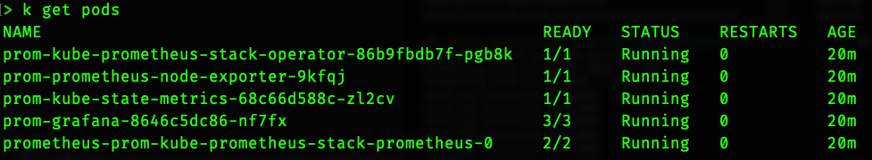
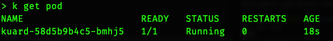
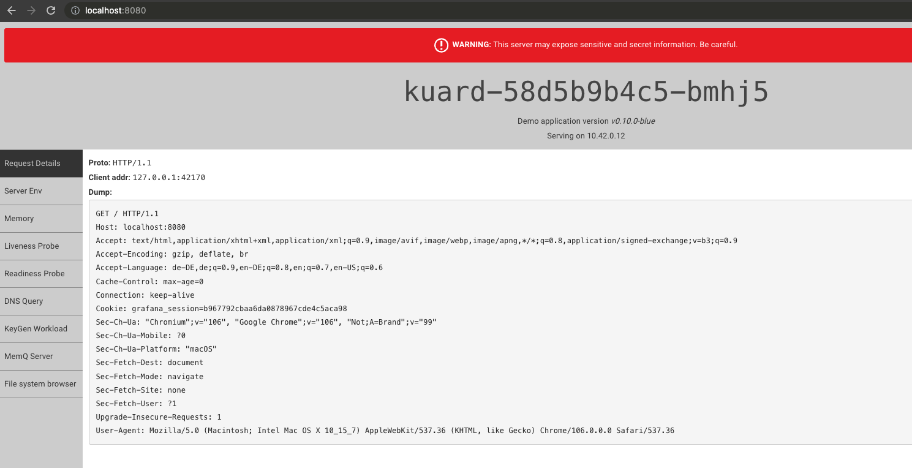
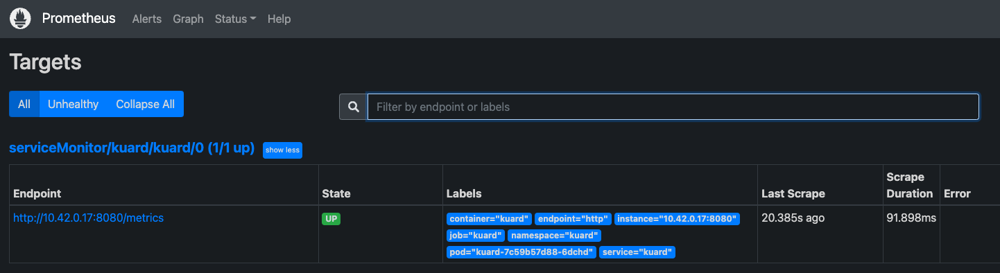
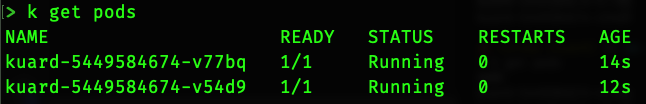
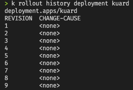
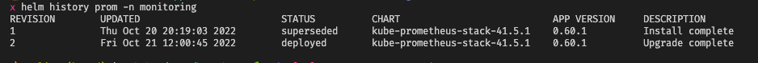
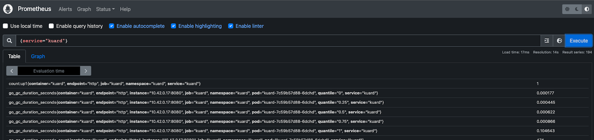

MB K8s Challenge
================

Setup
-----

Tested with
```
colima version 0.4.6
git commit: 10377f3a20c2b0f7196ad5944264b69f048a3d40

runtime: containerd
arch: aarch64
client: v0.23.0
server: v1.6.8

kubernetes
Client Version: v1.25.3
Kustomize Version: v4.5.7
Server Version: v1.25.0+k3s1
```
On MacBook Pro with M1

### Install prerequisites & start VM and K8s

```sh
brew install colima kubectl helm helmfile kustomize

# needed for helmfile apply and helmfile diff
helm plugin install https://github.com/databus23/helm-diff

# start virtual machine with k8s
colima start --runtime containerd --memory 4 --kubernetes
```

Prometheus & Grafana
--------------------

- No alertmanager (not needed according to challenge)
- Node exporter with adjustments to work in virtualized environment
  ```yaml
  prometheus-node-exporter:
  hostRootFsMount:
    enabled: false
  ```

### Installation

```sh
cd infra/monitoring

# add custom resource definitions
kubectl create -f crds/

# apply helm chart
helmfile apply
```



### Access Grafana

```sh
# enable port forwarding between localhost port 8080 and grafana service on port 80
kubectl -n monitoring port-forward svc/prom-grafana 8080:80
```

Open browser under `http://localhost:8080` and enter default credentials `admin:prom-operator`.

kuard
-----

- Deployment is implemented with `kustomize`
  - This documentation assumes that the standalone tool is installed instead of using the `kubectl kustomize` subcommand
- It consists of:
  - `Deployment`
  - `Service`
  - `HorizontalPodAutoscaler`
  - `ServiceMonitor`
- There are no overlays because there is only one environment

### Deployment

```sh
cd apps/kuard

# create namespace
kubectl create ns kuard

# deploy kustomize output
kustomize build | kubectl -n kuard apply -f -
```







Tasks
=====

## How could a logging solution in a Kubernetes environment look like?

> Due to memory and CPU constraints the following solution has not been fully tested. Kibana and Elasticsearch alone use 1 CPU and 2 GB of RAM each. Anyway it will be explained how the solutions works and looks like.

A logging solution usually consists of three different parts. The first part is the component that is able to scrape / gather, filter and forward the logs to some place. This "place" is the second component. It's role is the backend or storage that stores the previously gathered logs and makes it accessible in some way or another. Additionally it should also arrange and sort the logs in way that they can be searched and filtered. The last component accesses the storage to retrieve the logs and visualize them in an user interface. It should be able to send queries to the backend, retrieve the logs and helps the user to search what he/she is looking for.
Those three parts don't necessarily need to be split into different applications. But it general they're splitted because they solve different problems or accomplish different tasks.

In this solution the three parts are the following (also known as __EFK__ stack):

- Scraping: [Fluent Bit](https://fluentbit.io/)
- Storage: [Elasticsearch](https://github.com/elastic/elasticsearch)
- UI: [Kibana](https://github.com/elastic/kibana)

Fluent Bit is lightweight log forwarder and is in this solution running as a `DaemonSet`. On every node it's able to access all the container logs as they're mounted into the Fluent Bit container. Besides that it can also access the kubelet logs by accessing systemd. After some enrichment (K8s metadata) it will be send to Elasticsearch wherease the streams are splitted by container and node / kubelet logs.

Elasticsearch itself is running as a `StatefulSet` as it needs to store the log data on a persistent storage and it can be used in a clustered mode.

Kibana runs as a `Deployment` as it's a stateless application that is more or less only a UI for Elasticsearch.

All three components are available as individual helm charts and can be deployed as follows.

```sh
cd infra/logging

# apply all three charts at once
helmfile apply
```

Logs should be forwarded and stored in Elasticsearch automatically. To view the logs you need to expose the Kibana service.

```sh
# enable port forwarding between localhost port 5601 and kibana service on port 5601
kubectl port-forward -n logging svc/kibana-kibana 5601:5601
```

Open the browser under http://localhost:5601, create the index pattern (`logstash-*`) and start searching the logs.

This solution is not the only possible way to implement a logging system. Those three parts can be exchanged or replaced by other tools. For example instead of using Fluent Bit you could use [Fluentd](https://www.fluentd.org/) or [Logstash](https://github.com/elastic/logstash).
Elasticsearch and Kibana could be replaced by [Loki](https://github.com/grafana/loki) (storage) and Grafana (UI), especially since Grafana is already used as part of the monitoring solution.

## How to achieve application scalability caused by a lot of requests?

The simplest method is to increase the `Pod`'s resource limits or to remove them completely. This vertical scaling approach is highly discouraged as it's ignoring the benefits of using a distributed orchestrator like Kubernetes. 

Instead of deploying a single `Pod` for an app to serve traffic it's better to embed the `Pod` within a `ReplicaSet`. Typically you use a `Deployment` instead of a `ReplicaSet` directly which itself creates and manages `ReplicaSets` underneath.

The benefit of a `ReplicaSet` over a single `Pod` is that it's able to create multiple instances of the same `Pod`. A `Service` object then abstracts the load distribution via a set of `EndPoints` which are connected to a `Pod`. Depending on the amount of requests or load you could manually increase the number of replicas and the `Service` is responsible to distribute the traffic automatically.

Increasing (or decreasing) the amount of replicas can be done by executing the following command.

```sh
# set the number of replicas of the kuard deployment
kubectl scale -n kuard deployment kuard --replicas 2
```



It's also possible to do that with the underlying `ReplicaSet` instead of the `Deployment`.

Since manual scaling is error prone and can take a lot of time it might be better to look for an automated way. For this reason there is the so called `HorizontalPodAutoscaler` (HPA) object within Kubernetes. In short HPAs can be used to track specific metrics of e.g. a `Deployment` and change the numbers of replicas accordingly. The metrics are scraped via the metrics-server which usually runs as part of every Kubernetes installation.

The demo application includes an HPA (`apps/kuard/hpa.yaml`) that will scale the application in case the average CPU utilization is higher than 70% of the CPU requests. The scale up can be simulated by running a load test tool like [ApacheBench](https://httpd.apache.org/docs/2.4/programs/ab.html) with the following command.

```sh
# enable port forwarding between localhost port 8080 and kuard service on port 80
kubectl port-forward -n kuard svc/kuard 8080:80

# start load test with 10000 requests in total and a concurrency of 100
ab -n 10000 -c 100 http://localhost:8080/
```

This should increase the number of replicas automatically after some time.

## How to detect errors in templating before an actual deployment?

In order to reduce the errors that can happen either within manifests, templating or values it's advisable to validate or lint the output before applying it. There are 3rd party tools that can check the manifests and integrated options to achieve it. All the options below can either be used in combination with helm or kustomize or even other templating tools. It's important to send the final output to the tool of choice. Since `kuard` uses `Kustomize` only those examples are shown below. To generate the helm output the `helm template ...` command can be used. 

> In general it's a good idea to put those checks into continuous delivery / deployment pipelines before they're finally pushed to Kubernetes.

One of the issues a user can run into with 3rd party applications are custom resources. 3rd party applications like [datree](https://github.com/datreeio/datree), [kubeval](https://kubeval.instrumenta.dev/) and [kubeconform](https://github.com/yannh/kubeconform) usually need to be instructed how to validate custom resources with the help of schema files in JSON format.

If there are no custom resources in use (only default ojects like `Deployment`, `Service`, `ConfigMap`, `Secret` etc.) then the tools mentioned above are a good way to check if the output is valid.

An already integrated approach is to use `kubectl` in combination with the `--dry-run` flag. Here it's possible to let either the client or the server validate the rendered template or manifests.

```sh
# change into kuard directory
cd apps/kuard

# client side validation
kustomize build | kubectl apply -n kuard --dry-run=client -f -

# server side validation
kustomize build | kubectl apply -n kuard --dry-run=server -f -
```

Server side validation is always preferable since it already knows all the `CustomResourceDefinitions`. But client side validation might be needed if the executing system is not able or allowed to run the validation against the Kubernetes API.

## Which options do you have to rollback an errorneous deployment to an earlier version?

If a deployment of an application is not running as expected then there are multiple options how to rollback. It depends on the tooling that is used to do the deployment at all. The following list has three potential approaches but it does not cover all possible solutions.

### Manual rollback

Whenever the `.spec` part within a `Deployment` changes then there will be a new history entry. The history of a `Deployment` can be checked with the following command.

```sh
# print the history for the kuard deployment
kubectl rollout -n kuard history deployment kuard
```



Unfortunately the `CHANGE-CAUSE` column is not used by default and it might not be in the [future](https://github.com/kubernetes/kubernetes/issues/40422). Anyway it's possible to rollback to the latest or any other previous revision with the `rollout undo` command.

```sh
kubectl rollout undo deployment kuard [--to-revision=8]
```

If the `--to-revision` parameter – which is optional – is omitted then automatically the last revision is used.

### Helm

Every `helm upgrade` command creates a new history entry which is actually just another secret that contains the deployment information. If Helm is used then it's easy to rollback with a single command.

```sh
# show history of a helm release
helm history -n monitoring prom

# rollback to specific revision 1
helm rollback -n monitoring prom 1
```

Here the revision parameter is optional as well. If it's omitted then it will use the previous revision automatically.



### GitOps

Both methods above have the downside that it's hard to reason about a change and the rollback. With the [GitOps](https://www.gitops.tech/) approach things become more verbose. No matter if a GitOps tool like [ArgoCD](https://argoproj.github.io/cd/), [Flux](https://fluxcd.io/) or [Jenkins X](https://jenkins-x.io/) or a custom implementation is used every change is done _only_ in Git with one or multiple commits.

Let's say there's a new deployment triggered by a commit that changes a container's image to a new tag. First of all we can see the change in the Git history with (hopefully) a meaningful message. When the new container is faulty or doesn't even start and a rollback is needed then the last commit can simply be reverted and pushed. That will also rollback the `Deployment` to the previous, working version.

```sh
# git the commit hash that is faulty (-1 is just the latest)
git log -1

# revert the hash printed by previous command and add a meaningful message
git revert <hash>

# push to remote
git push
```

With this approach each and every change is part of the repository history and thus easier to comprehend.

## Which metrics does the demo app (kuard) provide?

They can be found under the `/metrics` route. On a local / dev cluster you can access them as follows:

```sh
# enable port forwarding between localhost port 8080 and kuard service on port 80
kubectl port-forward -n kuard svc/kuard 8080:80
curl http://localhost:8080/metrics
```
curl output:

```
# HELP go_gc_duration_seconds A summary of the GC invocation durations.
# TYPE go_gc_duration_seconds summary
go_gc_duration_seconds{quantile="0"} 0.000195
go_gc_duration_seconds{quantile="0.25"} 0.000463
go_gc_duration_seconds{quantile="0.5"} 0.000641
go_gc_duration_seconds{quantile="0.75"} 0.000865
go_gc_duration_seconds{quantile="1"} 0.046545
go_gc_duration_seconds_sum 0.509364
go_gc_duration_seconds_count 335
# HELP go_goroutines Number of goroutines that currently exist.
# TYPE go_goroutines gauge
go_goroutines 6
[...]
```

There is also a custom resource `ServiceMonitor` within the `kuard` namespace that is collecting the metrics. They can be checked in prometheus with the query `{service="kuard"}`. To expose prometheus you can run the following.

```sh
# enable port forwarding between localhost port 9090 and prometheus service on port 9090
kubectl port-forward -n monitoring svc/prom-kube-prometheus-stack-prometheus 9090:9090
```

Afterwards you can access prometheus in the browser via http://localhost:9090.



## Which one would be the CI/CD tool of your choice?

If the question is related to the demo application then CI can be ignored as the final image was present already.

If it's a general question then I'd look for some widely used solution that has proven its value already, especially in the cloud native world. My choice would be either [GitHub Actions](https://github.com/features/actions) or something that is running directly inside the cluster (e.g. [Tekton](https://tekton.dev/) with [Kaniko](https://github.com/GoogleContainerTools/kaniko)).
Another tool that looks promising is [Dagger](https://dagger.io/) which can close the gap between a developer machine and the CI system that will really build the final image and run all the other pipeline steps.

Independent of the project I'd choose [Flux](https://fluxcd.io/) for the CD part. It allows the user to work with the GitOps approach, has an alerting system, works with various Git systems out of the box and supports various ways of keeping (unencrpyted) secrets out of the repository.

Additional Questions
====================

## How do I expose an application via an ingress controller and what are ingress controllers in general used for?

Ingress Controllers are (more or less) layer 7 load balancers which can be run in Kubernetes clusters. The name "controller" indicates that they listen on the K8s API to get notified when `Ingress` resources are created, updated or deleted. The controllers then adjust their configuration depending on what the `Ingress` resource is expecting. The ingress controller usually comes with a K8s service which can be exposed with e.g. type `LoadBalancer` and can be seen as a single entry point to one or more services that are deployed in the cluster.

There are some ingress controller implementations that are built on top of well known L7 load balancers (Nginx, HAProxy etc.) but also some others like Traefik.

The `Ingress` resources are built-in and don't need to be deployed explicitly. The main parts that can be configured in an `Ingress` resource are:

- Domains
- Paths
- Backends
- TLS

Domains will tell the ingress controller on which domain they should listen (HTTP `Host` header). Paths allow the user to separate the URL paths between different backends. A backend is the name of a service and a port so that the ingress controller knows where to route incoming requests. When it comes to TLS you can define where the ingress controller can find TLS certificates (in a secret) to secure the connection between the client and the L7 load balancer itself.

These are the default features that ingress controllers support. Some implementations extend these by either introducing custom resources or annotations.

## How could alerting in a K8s cluster look like? Which options are available?

`kube-prometheus-stack` comes per default with [Alertmanager](https://prometheus.io/docs/alerting/latest/alertmanager/). It integrates perfectly fine with prometheus, can validate alert rules and send alerts to various systems. This could be [Slack](https://slack.com), [PagerDuty](https://www.pagerduty.com/), e-mail or a generic HTTP webhook.

This is usually the default alerting method in most setups but depending on the provider that is used (e.g. Azure or AWS) there might be proprietary solutions that integrate much better into the whole platform but come with additional costs.

## Which options do you have to get data into Promehtheus' TSDB?

The default design is that Prometheus is scraping services (targets) automatically in an interval. This means that the service itself needs to expose a metrics route that Prometheus needs to be able to access.
If there is a service or job that is not scrapable (e.g. CronJob) it's possible to use the [Pushgateway](https://prometheus.io/docs/practices/pushing/) to push the metrics to this gateway instead of the pull model.

## Which options do you have to secure sensitive data (e.g. secrets) in a GIT repository? Which one would you choose?

First and foremost secrets should never be in a git repository as long as they're unencrypted. That means there are various ideas how to store them in an encrypted form in the repository or use another mechanism that will not even store the encrypted ones there.

### Encryption

- [sops](https://github.com/mozilla/sops)
  Can encrypt yaml and json files so that they can be stored in a repository. The encryption key can either be stored locally or in a KMS (e.g Azure Key Vault)
- [Sealed Secrets](https://github.com/bitnami-labs/sealed-secrets)
  Sealed secrets are custom resources that will be encrypted and stored in the repository. They can be pushed as custom resources to the cluster. The sealed secrets operator will create a `Secret` from a sealed secret.
- [Helm Secrets](https://github.com/jkroepke/helm-secrets)
  Builds on top of sops and is a helm plugin. It makes use of conventions and the `helm secrets` command acts as a wrapper around the intended command and will handle all the encryption and decryption things.

### Other solutions

- CSI Driver (e.g. [Azure Key Vault CSI Driver](https://github.com/Azure/secrets-store-csi-driver-provider-azure))
  Those drivers (Container Storage Interface) can connect to KMS (e.g. Azure Key Vault) and read secrets from there. They will mount selected secrets as files within a volume mount in containers and can be read from there.

## Which options do you have to completely remove data that has been leaked into a GIT repository by mistake?

Once a secret has been pushed to a Git remote it gets complicated to remove it again. The most simple method would be to remove the remote repository, delete the .git folder locally, create a new one remotely, remove the secret file and push. This has the downside that all users need pull the new repo and the complete history is lost.

If the file has only been comitted locally and not yet pushed then it's also relatively easy to fix the issue with `git reset HEAD~1` to jump to the penultimate commit.

If the history needs to be retained but the secret file needs to be removed then the best way is probably [`git-filter-repo`](https://github.com/newren/git-filter-repo). This is a tool to filter specific files in a repository and rewrite history. For big repositories it can take some time. After the filtering is done it needs to be pushed to the remote and all other users need to pull the repository again. One good thing though is that it is going to remove the current used origins in order to avoid a push by mistake.